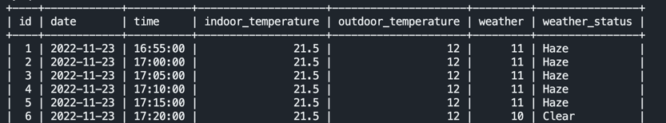

# Monitor_dormitory_temperature
# 监控宿舍温度
## 功能
&emsp;&emsp;&emsp;&emsp;记录室内室外的温度并储存到Mysql中，同时通过和风天气的API获取当地的温度和天气状况（精确到小时）。

## 说明
&emsp;&emsp;&emsp;&emsp;宿舍安装了海享租的空调，可以在空调的控制界面查看到室内室外的温度，所以写了这么一个小程序来记录温度变化和天气。   
&emsp;&emsp;&emsp;&emsp;打算用来给后面练习Django提供数据

## 使用帮助
&emsp;&emsp;&emsp;&emsp;把```authorization```换成自己的，可以在微信里面抓包。设备ID也换一下。

## 问题
&emsp;&emsp;&emsp;&emsp;做完运行了一下午才发现空调只有开着的时候才能测温...尴尬了。夏天用的空调比较多，冬天有暖气所以基本上不会开空调。


## Mysql 命令
```
CREATE TABLE IF NOT EXISTS `ROOM223`(`id` INT UNSIGNED AUTO_INCREMENT,`date` DATE,`time` TIME,`indoor_temperature` FLOAT NOT NULL,`outdoor_temperature` FLOAT NOT NULL, `weather` FLOAT NOT NULL,`weather_status` VARCHAR(20) NOT NULL, PRIMARY KEY (`id`) )ENGINE=InnoDB DEFAULT CHARSET=utf8;
```

## 效果

